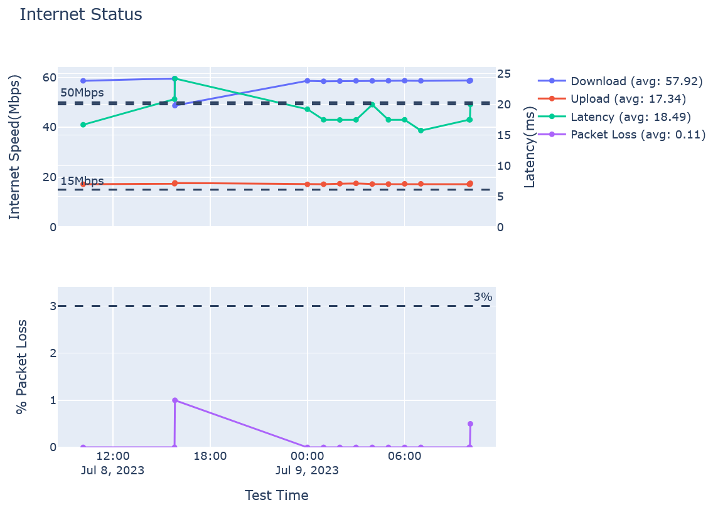

# Internet Troubleshooter

[](https://codecov.io/github/bethune-bryant/internet-troubleshooter)

## Overview

This is an internet performance tracking and troubleshooting utility which uses tools like `ping`, `traceroute`, and the [SpeedTest CLI](https://www.speedtest.net/apps/cli#ubuntu).

## Getting Started

To get started you can setup a Python virtual environment and use pip to install the troubleshooter.

```shell
# install speedtest-cli
sudo apt-get install curl
curl -s https://packagecloud.io/install/repositories/ookla/speedtest-cli/script.deb.sh | sudo bash
sudo apt-get install speedtest
# install python-venv and create venv
sudo apt install python3.10-venv
python3 -m venv ./my_env
source ./my_env/bin/activate
# install internet-troubleshooter
pip install git+https://github.com/bethune-bryant/internet-troubleshooter.git
# run internet-troubleshooter
checkinternet run
```

> For a more accurate packet loss, run checkinternet as `root`.

## Tracking and Displaying Statistics

The `checkinternet` script supports logging results to a yaml file and then displaying them to either the console or an html file.

```shell
$ checkinternet run --yaml_file troubleshooting.yaml
...
$ checkinternet display --yaml_file /home/brnelson/troubleshooting.yaml
Download:
  Mean: 57.97Mbps
  Variance: 6.69Mbps
  Min: 48.66Mbps
  Max: 59.48Mbps

Upload:
  Mean: 17.33Mbps
  Variance: 0.03Mbps
  Min: 17.15Mbps
  Max: 17.72Mbps

Latency:
  Mean: 18.54Mbps
  Variance: 4.38Mbps
  Min: 15.73Mbps
  Max: 24.19Mbps

Packet Loss:
  Mean: 0.10%
  Variance: 0.08%
  Min: 0.00%
  Max: 1.00%
$ checkinternet display --yaml_file troubleshooting.yaml --format html > troubleshooting.html
```



## Automatic Checking

You can setup a cronjob to automatically run the troubleshooter at some interval. E.g., once every hour between midnight and 7AM:

```shell
crontab -e
```

```bash
0 0-7 * * * source /home/USER/git/internet-troubleshooter/my_env/bin/activate && checkinternet --debug run --yaml_file /home/USER/troubleshooting.yaml >> /home/USER/troubleshooting.log 2>&1
```
