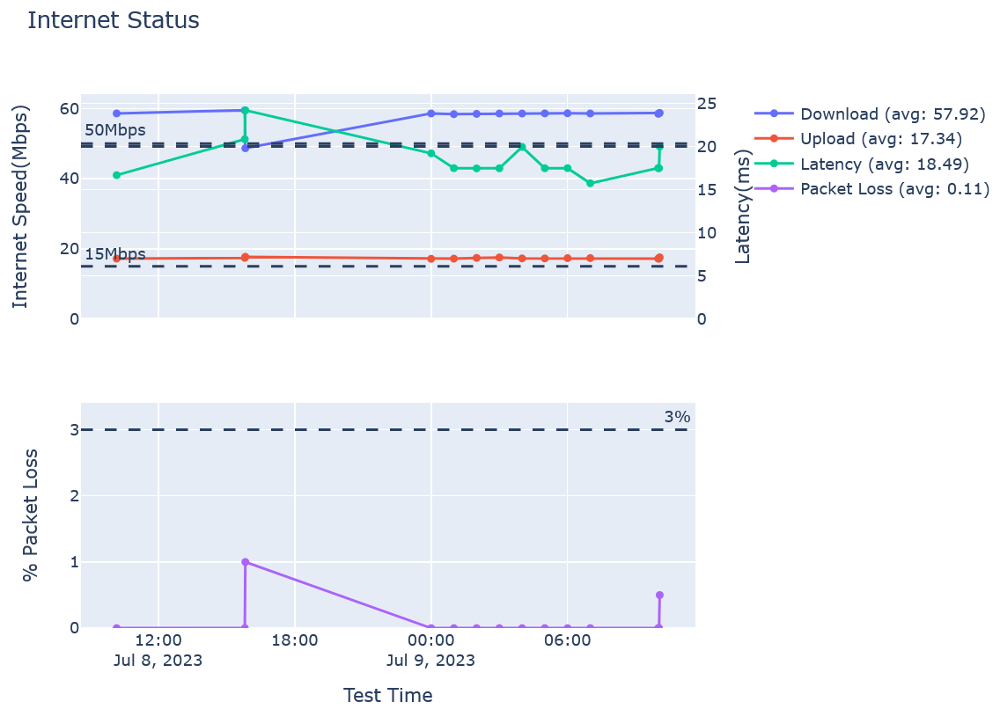

# Internet Troubleshooter

[](https://codecov.io/github/bethune-bryant/internet-troubleshooter)

## Overview

This is an internet performance tracking and troubleshooting utility which uses tools like `ping`, `traceroute`, and the [SpeedTest CLI](https://www.speedtest.net/apps/cli#ubuntu).

A single run measures packet loss to a target address and download, upload, and latency figures from the Speedtest CLI. When packet loss is high, it also traceroutes to the target and measures packet loss to each intermediate hop, which helps show whether the problem is inside your network or upstream of it. Results can be appended to a YAML file and later summarized as text or as an interactive HTML plot.

## Prerequisites

`checkinternet` shells out to system tools, which must be installed separately:

| Requirement | Notes |
| --- | --- |
| Python 3.9 or newer | |
| `ping` | Usually preinstalled. Part of `iputils-ping` on Debian/Ubuntu. |
| `traceroute` | `sudo apt install traceroute`, or the `inetutils-traceroute` package. Only needed when packet loss exceeds `--max_packet_loss`. |
| Ookla `speedtest` CLI | See below. Only needed for speed tests. |

If the `speedtest` CLI is missing, `checkinternet run` prints a warning and reports only packet loss; it does not fail. If `traceroute` is missing, the traceroute step reports an error and is skipped.

Debian and Ubuntu package two unrelated traceroute implementations and either one works. The classic `traceroute` package is preferred but not required: it is asked to skip reverse lookups with `-n`, while `inetutils-traceroute`, which rejects `-n` and prints numeric addresses anyway, is run without it. The right invocation is detected from the installed binary's help text, so nothing needs to be configured.

Install the Ookla Speedtest CLI on Debian/Ubuntu with:

```shell
sudo apt-get install curl
curl -s https://packagecloud.io/install/repositories/ookla/speedtest-cli/script.deb.sh | sudo bash
sudo apt-get install speedtest
```

## Install

Install into a virtual environment:

```shell
sudo apt install python3-venv
python3 -m venv ./my_env
source ./my_env/bin/activate
```

Then pick the install that matches what you need:

```shell
# core: run tests, log results, and display text summaries
pip install git+https://github.com/bethune-bryant/internet-troubleshooter.git

# with HTML plots: adds plotly, required for `display --format html`
pip install "git+https://github.com/bethune-bryant/internet-troubleshooter.git#egg=internet-troubleshooter[html]"
```

To work on the project itself, clone it and install the `dev` and `html` extras:

```shell
git clone https://github.com/bethune-bryant/internet-troubleshooter.git
cd internet-troubleshooter
pip install -e ".[dev,html]"
```

## Getting Started

```shell
checkinternet run
```

> For more accurate packet loss, run `checkinternet` as `root`. Only root may flood ping (`ping -f`), which is what makes it possible to measure loss over hundreds of packets in a few seconds. As a normal user the test falls back to a plain `ping` with a much smaller sample, and prints a warning to that effect.

## Command Line Reference

`--debug` is a global flag and must come *before* the subcommand:

```shell
checkinternet --debug run --yaml_file troubleshooting.yaml
```

| Flag | Applies to | Default | Description |
| --- | --- | --- | --- |
| `--version` | global | n/a | Print the installed version and exit. Works without a subcommand. |
| `--debug` | global | off | Print progress and the raw output of each command to stderr. |
| `--ping_ip` | `run` | `8.8.8.8` | IP address or hostname to test against. Must be a valid address or hostname. |
| `--ping_count` | `run` | 400 as root, else 10 | Number of packets to send to the target. Must be at least 1. |
| `--trace_hop_ping_count` | `run` | 50 as root, else 10 | Number of packets to send to each traceroute hop. Must be at least 1. |
| `--max_packet_loss` | `run` | `3.0` | Packet loss percent above which a traceroute is run. |
| `--skip_speedtest` | `run` | off | Skip the Speedtest CLI test. |
| `--skip_pingtest` | `run` | off | Skip the ping test. This also skips the traceroute, since the traceroute is triggered by the ping result. |
| `--yaml_file` | `run` | none | Append this run's results to the given file. Without it, results are printed but not recorded. |
| `--yaml_file` | `display` | required | File of logged results to read. |
| `--format` | `display` | `human` | `human` for a text summary or `html` for an interactive plot. Both are written to stdout. |
| `--target_download_mbps` | `display` | `50` | Download speed the HTML report treats as healthy. |
| `--target_upload_mbps` | `display` | `15` | Upload speed the HTML report treats as healthy. |
| `--target_latency_ms` | `display` | `20` | Highest latency the HTML report treats as healthy. |
| `--target_packet_loss_pct` | `display` | `3` | Highest packet loss the HTML report treats as healthy. |

### How `--max_packet_loss` gates the traceroute

The traceroute is diagnostic and is only run when something looks wrong. After the ping test, a traceroute runs if either the ping test failed outright or the measured packet loss is greater than `--max_packet_loss`. Set it to `0` to traceroute on any loss at all, or pass `--skip_pingtest` to never traceroute.

Each intermediate hop found by the traceroute is then pinged as well. The target address itself is skipped, since the primary ping test already covers it, and repeated addresses are only pinged once — a single router commonly answers for several consecutive hops.

The hop sample size is set by `--trace_hop_ping_count` and is independent of `--ping_count`. Its default is smaller than the target's so that a long trace does not multiply the runtime of the whole check: 50 packets per hop as root, or 10 otherwise. Root still floods (`ping -f`) for hops, so 50 packets per hop stays fast. Pass the flag explicitly to use the same count for every hop regardless of user, for example `checkinternet run --ping_count 400 --trace_hop_ping_count 100`.

## Exit Codes

| Code | Meaning |
| --- | --- |
| 0 | Success. This includes runs where a test was skipped, such as when the `speedtest` CLI is not installed. |
| 1 | `--ping_ip` is not a valid address or hostname; `--ping_count` or `--trace_hop_ping_count` is less than 1; the results file could not be written or read; or every test that was attempted failed. |
| 2 | The command line itself could not be parsed, for example a missing subcommand or an unknown flag. |

## Tracking and Displaying Statistics

The `checkinternet` script supports logging results to a YAML file and then displaying them to either the console or an HTML file.

```shell
$ checkinternet run --yaml_file troubleshooting.yaml
...
$ checkinternet display --yaml_file troubleshooting.yaml
Download:
  Mean: 57.97Mbps
  Variance: 6.69Mbps
  Min: 48.66Mbps
  Max: 59.48Mbps

Upload:
  Mean: 17.33Mbps
  Variance: 0.03Mbps
  Min: 17.15Mbps
  Max: 17.72Mbps

Latency:
  Mean: 18.54ms
  Variance: 4.38ms
  Min: 15.73ms
  Max: 24.19ms

Packet Loss:
  Mean: 0.10%
  Variance: 0.08%
  Min: 0.00%
  Max: 1.00%
$ checkinternet display --yaml_file troubleshooting.yaml --format html > troubleshooting.html
```

HTML output requires the `html` extra; without it `display --format html` fails with an error stating that plotly is not installed.

The HTML report is a single self-contained dark themed page with three sections: metric cards showing the mean, minimum, and maximum of each measurement against its healthy threshold; three stacked charts sharing one time axis, holding download and upload, latency, and packet loss; and a scrollable table of traceroute hops with one column per run, whose addresses and loss figures can be selected and copied.

Hovering any of the charts reports every metric recorded for that run together, so a latency spike can be read against the speed and packet loss measured at the same moment. Runs where a test did not complete are marked with a dotted red line and report the metrics they are missing as `no data`.



### Choosing the Healthy Thresholds

The thresholds the report considers healthy set the dashed reference lines on the charts, decide whether each metric card reads as good or bad, color the per-hop loss figures in the traceroute table, and are restated in the page footer. They default to the values of a typical broadband plan and can be pointed at your own with four `display` flags:

```shell
$ checkinternet display --yaml_file troubleshooting.yaml --format html \
    --target_download_mbps 500 --target_upload_mbps 100 \
    --target_latency_ms 15 --target_packet_loss_pct 0.5 > troubleshooting.html
```

The flags only affect the HTML report; `--format human` prints the same summary regardless.

### Result Log Format

Each run appends one YAML document to the file, so the same file can be reused indefinitely. Results are written as plain dictionaries with `snake_case` keys using safe YAML, and are read back with a safe loader, so a results file can never execute code when it is loaded. Only this dictionary format is supported; a file containing the `!!python/object` tags emitted by very old versions fails to load.

Versions before the `snake_case` rename wrote `camelCase` keys such as `pingResult` and `packetLoss`. Those keys are no longer recognized and there is no dual-read path: an old file still parses as YAML, but every measurement in it reads back as missing. Start a new results file, or rename the keys in the old one, rather than mixing the two formats.

A single document looks like this. Keys are sorted alphabetically, and any test that did not run is written as `null` — so `trace_result` is `null` unless a traceroute was triggered:

```yaml
ping_result:
  ip: 8.8.8.8
  packet_loss: 1.5
speed_result:
  download: 58.54
  latency: 19.27
  upload: 17.12
time_stamp: 1700000000.0
trace_result:
  ping_results:
  - ip: 10.0.0.1
    packet_loss: 0.0
```

## Automatic Checking

You can setup a cronjob to automatically run the troubleshooter at some interval. E.g., once every hour between midnight and 7AM:

```shell
crontab -e
```

```bash
0 0-7 * * * source /home/USER/git/internet-troubleshooter/my_env/bin/activate && checkinternet --debug run --yaml_file /home/USER/troubleshooting.yaml >> /home/USER/troubleshooting.log 2>&1
```

## Development

```shell
pip install -e ".[dev,html]"
black --check .
flake8 . --max-complexity=10
pytest --cov=internet_troubleshooter
```
